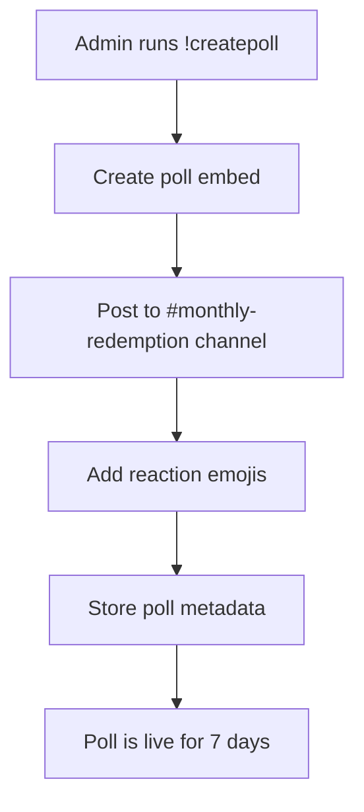
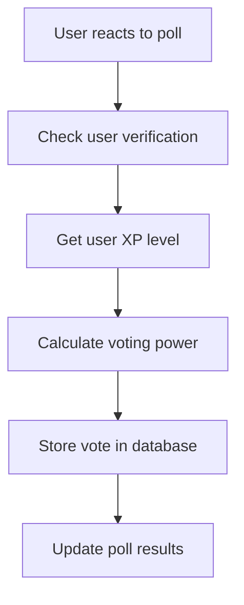
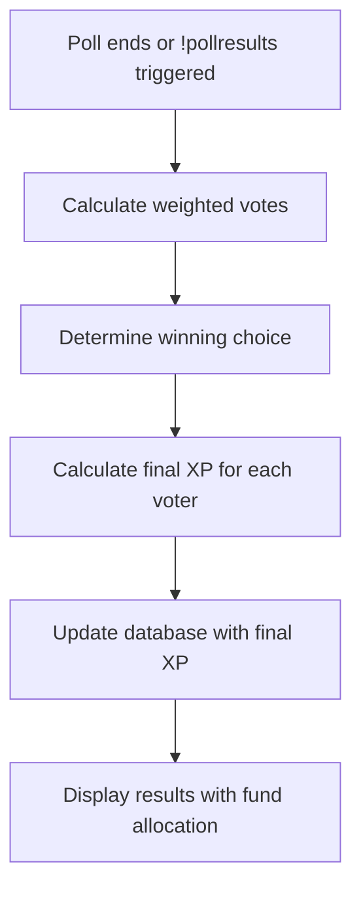

# 🗳️ Poll System Documentation

## Overview

The VerifyMe Bot features an advanced **Monthly Resource Allocation Poll System** that allows community members to vote on how to allocate monthly community resources. The system uses weighted voting based on user XP levels and provides XP rewards for participation.

## 🏗️ System Architecture

### Core Components

1. **Poll Creation** - `createEnhancedMonthlyPoll()`
2. **Vote Processing** - `getEnhancedPollResults()`
3. **XP Calculation** - `calculatePollXP()`
4. **Voting Power** - `getVotingPower()`
5. **Database Storage** - `storePollData()`
6. **Results Display** - `displayEnhancedPollResults()`

## 📊 Poll Structure

### Poll Options

Each poll presents three resource allocation choices:

| Option | Emoji | Description | XP Multiplier |
|--------|-------|-------------|---------------|
| **Peace Initiatives** | 🕊️ | Community building, conflict resolution, solidarity programs | 1.0x |
| **Voting Programs** | 🗳️ | Democratic participation, voter education, civic engagement | 1.5x |
| **Disaster Relief** | 🆘 | Emergency response, humanitarian aid, crisis support | 2.0x |

### Poll Duration
- **Duration**: 7 days
- **Auto-end**: Automatic results processing after 7 days
- **Manual processing**: Can be triggered early with `!pollresults <message_id>`

## ⚖️ Voting Power System

### XP-Based Weighted Voting

Voting power is calculated based on user XP levels using the `getVotingPower()` function:

```javascript
function getVotingPower(xpLevel) {
    if (xpLevel >= 1e168) return 100;      // e+168+ = 100x power
    if (xpLevel >= 1e120) return 50;       // e+120+ = 50x power  
    if (xpLevel >= 1e48) return 25;        // e+48+ = 25x power
    if (xpLevel >= 1e24) return 10;        // e+24+ = 10x power
    if (xpLevel >= 1e12) return 5;         // e+12+ = 5x power
    if (xpLevel >= 1e6) return 2;          // e+6+ = 2x power
    return 1;                              // e+0 to e+6 = 1x power
}
```

### Voting Power Tiers

| XP Level | Voting Power | Description |
|----------|--------------|-------------|
| e+0 to e+6 | 1x | Basic voting power |
| e+6+ | 2x | Double voting power |
| e+12+ | 5x | 5x voting power |
| e+24+ | 10x | 10x voting power |
| e+48+ | 25x | Top contributor level |
| e+120+ | 50x | Elite contributor |
| e+168+ | 100x | Maximum voting power |

## 💰 XP Reward System

### Base Rewards

All participants receive base XP for voting:

```javascript
const baseXP = 1000000;        // 1M XP for voting
const winningBonus = 5000000;  // 5M XP if your choice wins
const topContributor = 10000000; // 10M XP for top contributors
```

### XP Calculation Logic

```javascript
function calculatePollXP(voter, winningChoice) {
    let totalXP = baseXP; // Start with 1M base XP
    
    // Add winning bonus if their choice won
    if (voter.choice === winningChoice) {
        totalXP += winningBonus; // +5M XP
    }
    
    // Add top contributor bonus
    if (voter.votingPower >= 25) {
        totalXP += topContributor; // +10M XP
    }
    
    return totalXP;
}
```

### XP Reward Tiers

| Scenario | Base XP | Winning Bonus | Top Contributor | Total XP |
|----------|---------|---------------|-----------------|----------|
| **Basic Voter** | 1M | 0M | 0M | **1M XP** |
| **Winner** | 1M | 5M | 0M | **6M XP** |
| **Top Contributor** | 1M | 0M | 10M | **11M XP** |
| **Winning Top Contributor** | 1M | 5M | 10M | **16M XP** |

## 🗃️ Database Structure

### Poll Data Storage

Each vote is stored in the WordPress database via the SmallStreet API:

```javascript
const voteData = {
    poll_id: messageId,                    // Discord message ID
    email: userEmail,                      // User's email
    vote: choice,                          // 'peace', 'voting', or 'disaster'
    vote_type: 'monthly_poll',            // Type identifier
    discord_id: user.id,                  // Discord user ID
    username: user.username,              // Discord username
    display_name: member.displayName,     // Discord display name
    membership: 'verified',               // Membership status
    xp_awarded: baseXP,                   // XP amount (updated later)
    status: 'submitted',                  // Vote status
    submitted_at: timestamp               // Submission timestamp
};
```

### Final XP Awards

After poll results are processed, final XP entries are created:

```javascript
const finalXPData = {
    poll_id: pollId,
    email: userEmail,
    vote: 'final_xp_update',
    vote_type: 'xp_final_award',
    discord_id: userId,
    username: 'system_update',
    xp_awarded: finalXP,                  // Final calculated XP
    status: 'final_awarded',
    submitted_at: timestamp
};
```

## 🎮 Commands

### Admin Commands

| Command | Description | Usage |
|---------|-------------|-------|
| `!createpoll` | Create a new monthly poll | `!createpoll` |
| `!pollresults <message_id>` | Process poll results and award XP | `!pollresults 1234567890` |
| `!pollparticipants <message_id>` | Show detailed participant list | `!pollparticipants 1234567890` |
| `!participation` | Auto-find and analyze latest poll | `!participation` |
| `!checkpollchannel` | Verify poll channel accessibility | `!checkpollchannel` |
| `!pollhelp` | Show all poll commands | `!pollhelp` |

### User Interaction

Users vote by reacting to the poll message with:
- 🕊️ for Peace Initiatives
- 🗳️ for Voting Programs  
- 🆘 for Disaster Relief

## 🔄 Poll Lifecycle

### 1. Poll Creation


### 2. Voting Process


### 3. Results Processing


## 📈 Results Calculation

### Weighted Vote Calculation

```javascript
// Count raw votes
const voteCounts = {
    peace: 5,      // 5 people voted for peace
    voting: 3,     // 3 people voted for voting
    disaster: 2    // 2 people voted for disaster
};

// Calculate weighted votes based on voting power
const weightedVotes = {
    peace: 15,     // 5 votes × average 3x power
    voting: 9,     // 3 votes × average 3x power  
    disaster: 4    // 2 votes × average 2x power
};

// Winner determined by weighted votes
const winningChoice = 'peace'; // Highest weighted total
```

### Fund Allocation

Funds are allocated proportionally based on weighted votes:

```javascript
const totalFunds = 1000000; // $1M total
const peaceAllocation = (weightedVotes.peace / totalWeighted) * totalFunds;
const votingAllocation = (weightedVotes.voting / totalWeighted) * totalFunds;
const disasterAllocation = (weightedVotes.disaster / totalWeighted) * totalFunds;
```

## 🔧 Technical Implementation

### Key Functions

1. **`createEnhancedMonthlyPoll()`** - Creates the poll embed and posts it
2. **`getEnhancedPollResults(messageId)`** - Processes reactions and calculates results
3. **`calculatePollXP(voter, winningChoice)`** - Calculates XP rewards
4. **`awardPollXP(voters, winningChoice, pollId)`** - Awards final XP to database
5. **`getVotingPower(xpLevel)`** - Calculates voting power from XP
6. **`storePollData(voteData)`** - Stores vote data in database

### API Endpoints

- **GET** `/api/poll-xp/:pollId` - Get XP data for specific poll
- **GET** `/api/polls-xp` - Get all polls with XP summary
- **POST** `https://www.smallstreet.app/wp-json/myapi/v1/discord-poll` - Store poll data

## 🛡️ Security & Validation

### User Verification
- Users must be verified with SmallStreet to participate
- Unverified users can vote but receive reduced benefits
- Email verification required for full XP rewards

### Vote Validation
- Only one vote per user per poll
- Duplicate reactions are ignored
- Bot reactions are filtered out

### Admin Controls
- Only admin users can create polls and process results
- Poll results can only be processed once
- Database updates are atomic and error-handled

## 📊 Example Poll Results

```
📊 Monthly Poll Results - Resource Allocation
Community has spoken! Here are the weighted results and fund allocation.

🕊️ Peace Initiatives
Votes: 5
Weighted: 15
Allocation: 53.6%
Fund: $536,000

🗳️ Voting Programs  
Votes: 3
Weighted: 9
Allocation: 32.1%
Fund: $321,000

🆘 Disaster Relief
Votes: 2
Weighted: 4
Allocation: 14.3%
Fund: $143,000

🏆 Winning Choice
Peace won with 53.6% of weighted votes

👥 Participation
Total Voters: 10
XP Awards: Distributed
Total Weighted: 28
```

## 🚀 Future Enhancements

- **Automated Scheduling**: Monthly polls created automatically
- **Notification System**: Reminders for poll deadlines
- **Analytics Dashboard**: Historical poll data and trends
- **Mobile Integration**: Mobile-friendly poll interface
- **Advanced Voting**: Ranked choice or approval voting options

---

*This documentation covers the complete poll system implementation in the VerifyMe Bot. For technical support or feature requests, contact the development team.*
